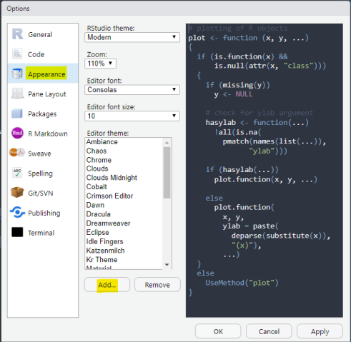

```{r utility, echo=FALSE}

# load all themes
rstudio_themes <- read.csv("data-raw/rstudio_themes.csv")

# sort alphabetically by theme name
rstudio_themes <- rstudio_themes[order(rstudio_themes$theme_name),]

# save outputs: CSV incl. header, CSV excl. header, RData file

write.csv(rstudio_themes,
          file = "data-raw/rstudio_themes.csv",
          row.names = FALSE)

save(rstudio_themes, file = "data/rstudio_themes.rda")
```

# RStudio Theme Collection

This is a collection of custom RStudio themes that offer alternatives to the default built-in themes. Below, you will find a list with **`r nrow(rstudio_themes)` RStudio themes** that have been created by users (`r sum(rstudio_themes$is_dark)` dark themes, `r nrow(rstudio_themes) - sum(rstudio_themes$is_dark)` light themes).

You can find [here](https://github.com/max-alletsee/rstudio-themes/blob/master/data-raw/rstudio_themes.csv) a CSV file, also including links to screenshots if available.

If you would like to learn more about how to create custom themes for RStudio, please see the [RStudio theme creation website](https://rstudio.github.io/rstudio-extensions/rstudio-theme-creation.html).

To add your own theme to the list, please open a pull request, add your theme to the file [data-raw/rstudio_themes.csv](https://github.com/max-alletsee/rstudio-themes/blob/master/data-raw/rstudio_themes.csv) and re-knit the file README.rmd. 

```{r check_for_duplicates, echo=FALSE}

# check for duplicated theme names

if (any(duplicated(rstudio_themes$theme_name))) {
  warning("Duplicated Theme Names!\n")
  cat(rstudio_themes$theme_name[duplicated(rstudio_themes$theme_name)])
}

# check for duplicated Github Direct Links

if (any(duplicated(rstudio_themes$github_direct_link))) {
  warning("Duplicated Github Direct Links!\n")
  cat(rstudio_themes$github_direct_link[duplicated(rstudio_themes$github_direct_link)])
}

# check for duplicated screenshot URLs

if (any(duplicated(rstudio_themes$screenshot) & rstudio_themes$screenshot > 1)) {
  warning("Duplicated screenshots!\n")
  cat(rstudio_themes$screenshot[duplicated(rstudio_themes$screenshot)])
}
```

## How to install/use custom themes

RStudio supports custom themes in version 1.20 or higher. Themes can be installed via "Tools" - "Global Options" - "Appearance" - "Add Theme". Once a theme is installed, the theme name will appear in the theme list and it can be activated by simply clicking on it.



The "rstudioapi" package includes an ["addTheme" function](https://rdrr.io/cran/rstudioapi/man/addTheme.html) that allows to install custom themes.

Moreover, this Github repository comes with a little pseudo-package that allows to install specific themes from the list below, also coming with the possibility for a bulk install. Below is a quick overview how to use this function.

```{r example_code, eval = FALSE}
    # install the pseudo-package from this Github repository
    devtools::install_github("max-alletsee/rstudio-themes")

    library(rstudiothemes) # ... then load the library

    # example 1: bulk-install all light themes
    install_rstudio_themes(theme = "all_light")

    # example 2: install two specific light themes
    install_rstudio_themes(theme = c("Ayu Light", "Github {rsthemes}"))
```

## Dark Themes from R Users

```{r show_dark_themes, results='asis', echo=FALSE}
# filter on dark themes
themes_dark <- rstudio_themes[rstudio_themes$is_dark, ]


for (row in 1:nrow(themes_dark)) {
  # base text
  text <- paste0("* ", themes_dark$theme_name[row], " ([repo](", themes_dark$github_repository[row], "), [direct link](", themes_dark$github_direct_link[row], "))")
  
  # additional text if screenshot is available
  if(themes_dark$screenshot[row] != "") {
    text <- gsub(pattern = "))",
                 replacement = paste0("), [screenshot](", themes_dark$screenshot[row], "))"),
                 x = text)
  }
  
  # additional text if description is available
  if(nchar(themes_dark$description[row]) > 1) {
    text <- paste0(text, ": ", themes_dark$description[row])
  }

  cat(paste(text, "\n"))
}
```

## Light Themes from R Users

```{r show_light_themes, results='asis', echo=FALSE}
# filter on dark themes
themes_light <- rstudio_themes[!rstudio_themes$is_dark, ]


for (row in 1:nrow(themes_light)) {
  # base text
  text <- paste0("* ", themes_light$theme_name[row], " ([repo](", themes_light$github_repository[row], "), [direct link](", themes_light$github_direct_link[row], "))")
  
  # additional text if screenshot is available
  if(themes_light$screenshot[row] != "") {
    text <- gsub(pattern = "))",
                 replacement = paste0("), [screenshot](", themes_light$screenshot[row], "))"),
                 x = text)
  }
  
  # additional text if description is available
  if(nchar(themes_light$description[row]) > 1) {
    text <- paste0(text, ": ", themes_light$description[row])
  }
  
  cat(paste(text, "\n"))
}
```

## Built-in RStudio Themes

The list below shows the full list of the currently built-in RStudio themes that are installed by default.

### Dark

* [Ambiance](https://github.com/rstudio/rstudio/blob/master/src/cpp/session/resources/themes/ambiance.rstheme)
* [Chaos](https://github.com/rstudio/rstudio/blob/master/src/cpp/session/resources/themes/chaos.rstheme)
* [Clouds Midnight](https://github.com/rstudio/rstudio/blob/master/src/cpp/session/resources/themes/clouds_midnight.rstheme)
* [Cobalt](https://github.com/rstudio/rstudio/blob/master/src/cpp/session/resources/themes/cobalt.rstheme)
* [Dracula](https://github.com/rstudio/rstudio/blob/master/src/cpp/session/resources/themes/dracula.rstheme)
* [Gob](https://github.com/rstudio/rstudio/blob/master/src/cpp/session/resources/themes/gob.rstheme)
* [Idle Fingers](https://github.com/rstudio/rstudio/blob/master/src/cpp/session/resources/themes/idle_fingers.rstheme)
* [Katzenmilch](https://github.com/rstudio/rstudio/blob/master/src/cpp/session/resources/themes/katzenmilch.rstheme)
* [Kr Theme](https://github.com/rstudio/rstudio/blob/master/src/cpp/session/resources/themes/kr_theme.rstheme)
* [Material](https://github.com/rstudio/rstudio/blob/master/src/cpp/session/resources/themes/material.rstheme)
* [Merbivore](https://github.com/rstudio/rstudio/blob/master/src/cpp/session/resources/themes/merbivore.rstheme)
* [Merbivore Soft](https://github.com/rstudio/rstudio/blob/master/src/cpp/session/resources/themes/merbivore_soft.rstheme)
* [Mono Industrial](https://github.com/rstudio/rstudio/blob/master/src/cpp/session/resources/themes/mono_industrial.rstheme)
* [Monokai](https://github.com/rstudio/rstudio/blob/master/src/cpp/session/resources/themes/monokai.rstheme)
* [Pastel on Dark](https://github.com/rstudio/rstudio/blob/master/src/cpp/session/resources/themes/pastel_on_dark.rstheme)
* [Solarized Dark](https://github.com/rstudio/rstudio/blob/master/src/cpp/session/resources/themes/solarized_dark.rstheme)
* [Tomorrow Night](https://github.com/rstudio/rstudio/blob/master/src/cpp/session/resources/themes/tomorrow_night.rstheme)
* [Tomorrow Night Blue](https://github.com/rstudio/rstudio/blob/master/src/cpp/session/resources/themes/tomorrow_night_blue.rstheme)
* [Tomorrow Night Bright](https://github.com/rstudio/rstudio/blob/master/src/cpp/session/resources/themes/tomorrow_night_bright.rstheme)
* [Tomorrow Night 80s](https://github.com/rstudio/rstudio/blob/master/src/cpp/session/resources/themes/tomorrow_night_eighties.rstheme)
* [Twilight](https://github.com/rstudio/rstudio/blob/master/src/cpp/session/resources/themes/twilight.rstheme)
* [Vibrant Ink](https://github.com/rstudio/rstudio/blob/master/src/cpp/session/resources/themes/vibrant_ink.rstheme)

### Light

* [Chaos](https://github.com/rstudio/rstudio/blob/master/src/cpp/session/resources/themes/chrome.rstheme)
* [Chrome](https://github.com/rstudio/rstudio/blob/master/src/cpp/session/resources/themes/chrome.rstheme)
* [Clouds](https://github.com/rstudio/rstudio/blob/master/src/cpp/session/resources/themes/clouds.rstheme)
* [Crimson Editor](https://github.com/rstudio/rstudio/blob/master/src/cpp/session/resources/themes/crimson_editor.rstheme)
* [Dawn](https://github.com/rstudio/rstudio/blob/master/src/cpp/session/resources/themes/dawn.rstheme)
* [Dreamweaver](https://github.com/rstudio/rstudio/blob/master/src/cpp/session/resources/themes/dreamweaver.rstheme)
* [Eclipse](https://github.com/rstudio/rstudio/blob/master/src/cpp/session/resources/themes/eclipse.rstheme)
* [iPlastic](https://github.com/rstudio/rstudio/blob/master/src/cpp/session/resources/themes/iplastic.rstheme)
* [Solarized Light](https://github.com/rstudio/rstudio/blob/master/src/cpp/session/resources/themes/solarized_light.rstheme)
* [SQL Server](https://github.com/rstudio/rstudio/blob/master/src/cpp/session/resources/themes/sqlserver.rstheme)
* [Textmate](https://github.com/rstudio/rstudio/blob/master/src/cpp/session/resources/themes/textmate.rstheme) (default theme)
* [Tomorrow](https://github.com/rstudio/rstudio/blob/master/src/cpp/session/resources/themes/tomorrow.rstheme)
* [Xcode](https://github.com/rstudio/rstudio/blob/master/src/cpp/session/resources/themes/xcode.rstheme)
